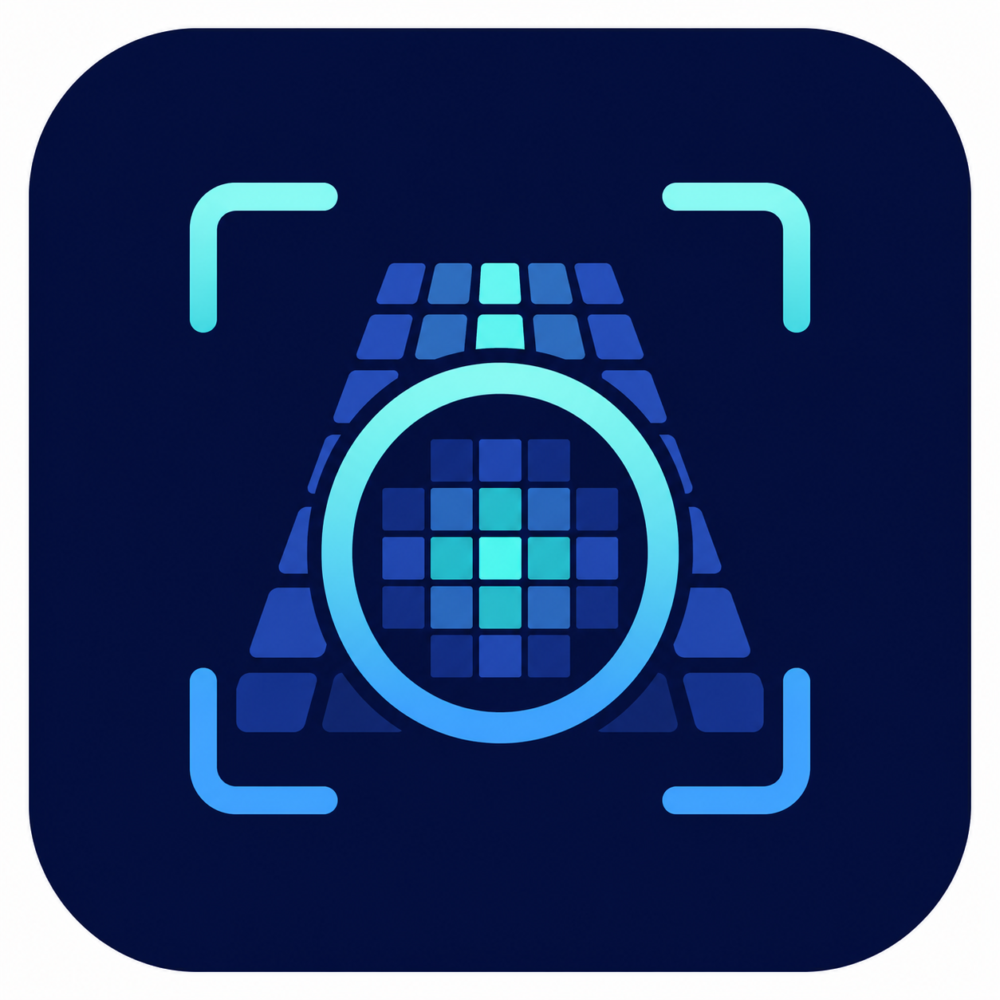
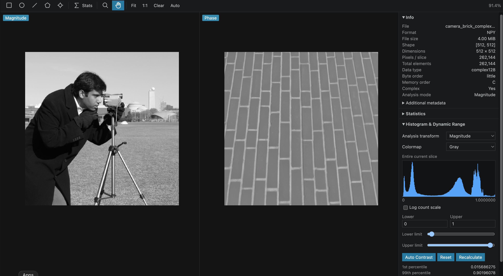

# ArrayScope Scientific Image Viewer



ArrayScope is a read-only VS Code custom editor for scientific NPY and TIFF images. It runs entirely in TypeScript, JavaScript, and WebGL—no Python, Conda, Jupyter kernel, or project runtime is started.



## Features

- NPY 1.0, 2.0, and 3.0 files with boolean, signed/unsigned integer, `float32`, `float64`, `complex64`, and `complex128` values.
- C-order, Fortran-order, and big-endian NPY data.
- Grayscale integer and floating-point TIFF images.
- 2D images and 3D/multipage stacks with slice navigation.
- Progressive loading and GPU-accelerated rendering.
- Interactive display-range and colormap changes.
- Synchronized magnitude and phase panels for complex arrays, with magnitude, phase, real, imaginary, log-magnitude, and magnitude-squared analysis modes.
- Rectangle, ellipse, line, polygon, sampler, magnifier, and pan tools.
- Selection-aware histograms, 1st/99th percentile auto contrast, and statistics for local and remote files.
- Full-resolution pixel value sampling.
- Manual image registration with draggable, progressively tiled overlays and transparency controls.
- VS Code theme colors, accessible controls, commands, and configurable keyboard shortcuts.

## Use

Open a `.npy`, `.tif`, or `.tiff` file. If VS Code does not select ArrayScope automatically, run **Reopen Editor With… → ArrayScope Scientific Image Viewer**.

The viewer never writes to the source. A selection scopes histogram, auto contrast, and the next explicit statistics calculation. Without a selection, all three operations use the entire current slice. The initial dynamic range uses the finite minimum and maximum; **Auto Contrast** applies the active scope's 1st and 99th percentiles, and **Reset** restores its finite minimum and maximum. Changing slices preserves selection geometry and clears the current sample marker.

Complex images always show synchronized Magnitude and Phase panels. The **Analysis transform** selector controls which representation is used by the histogram, auto contrast, and statistics.

## Keyboard shortcuts

These shortcuts are active while an ArrayScope editor is active. They are disabled when a text input or terminal has focus, so they do not interfere with typing elsewhere in VS Code.

| Shortcut | Action |
| --- | --- |
| `R` | Rectangle selection |
| `E` | Ellipse selection |
| `L` | Line selection |
| `P` | Polygon selection |
| `I` | Sample a pixel |
| `Z` | Magnifier tool |
| `H` | Pan tool |
| `Space` + drag | Pan temporarily without changing tools |
| `-` | Zoom out |
| `=` | Zoom in |
| `F` | Fit image to window |
| `1` | Show actual pixels (1:1) |
| `[` | Previous slice |
| `]` | Next slice |
| `Ctrl+Alt+Shift+S` (`Cmd+Alt+Shift+S` on macOS) | Calculate statistics |
| `Ctrl+Alt+Backspace` (`Cmd+Alt+Backspace` on macOS) | Clear selection |

## Remote workspaces

ArrayScope supports Remote SSH, WSL, and dev containers:

- files are opened and decoded near remote storage;
- only the data needed for the current view are sent to the viewer;
- the complete source array is not transferred by default.

Files larger than 256 MiB on non-file VS Code file systems require a provider that supports range reads.

## Settings

```json
{
  "scientificImageViewer.localCacheMB": 256,
  "scientificImageViewer.remoteCacheMB": 512,
  "scientificImageViewer.tileSize": 256,
  "scientificImageViewer.automaticHistogramPixelLimit": 1000000
}
```

The local cache limit applies to each open viewer. The remote cache limit applies to each open file.
Histograms are calculated automatically only when the active scope—the current slice or selection—contains at most `automaticHistogramPixelLimit` pixels. For larger scopes, click **Recalculate** in the histogram panel. Set the limit to `0` to require an explicit calculation for every non-empty scope.

## Supported data and limitations

NPY arrays are scalar scientific data; dimensions of size 3 or 4 are not inferred as RGB/RGBA. Scalars show their value, 1D arrays and arrays above 3D show an explicit dimensionality message, and `[slice, y, x]` is used for 3D stacks. Object and variable-length dtypes are rejected.

TIFF support is limited to grayscale images. Pages must match the first page's dimensions and sample type to participate in a stack. Available compression formats depend on the bundled TIFF decoder.

## Development

Requirements: Node.js 20 or newer and npm.

```bash
npm install
npm run typecheck
npm test
npm run build
```

Press `F5` from VS Code after building to launch an Extension Development Host, or run:

```bash
npm run test:integration
npm run package
```

`test:integration` downloads a matching VS Code test build on first use. `package` produces a VSIX after type checking, unit tests, and bundling.

## Numerical definitions

Statistics use population variance and standard deviation. Ordinary kurtosis is reported (a normal distribution has kurtosis 3). NaN, positive infinity, and negative infinity are excluded from finite statistics and reported separately. Median and histogram results are marked approximate when sampling is used.

## Security and failure behavior

ArrayScope validates NPY files before reading their data and detects source-file changes while an editor is open. Decoder and parsing errors appear in the custom editor with expandable technical details.
